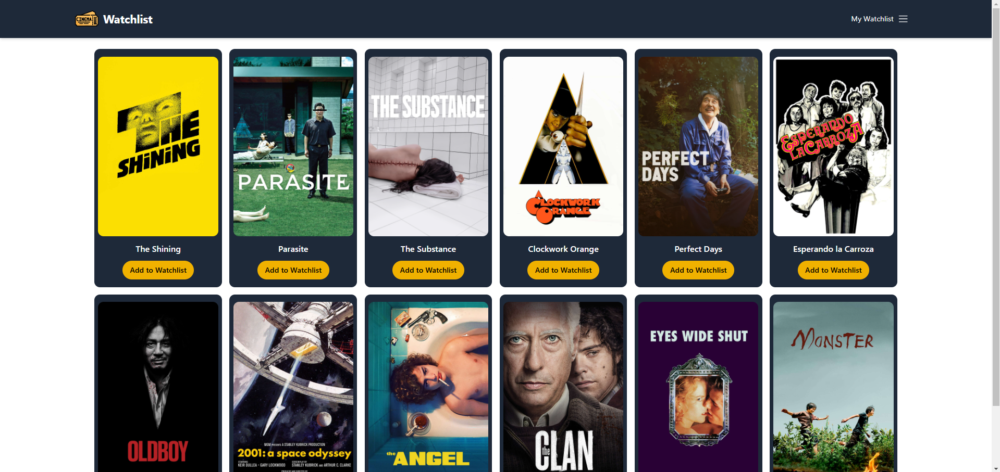
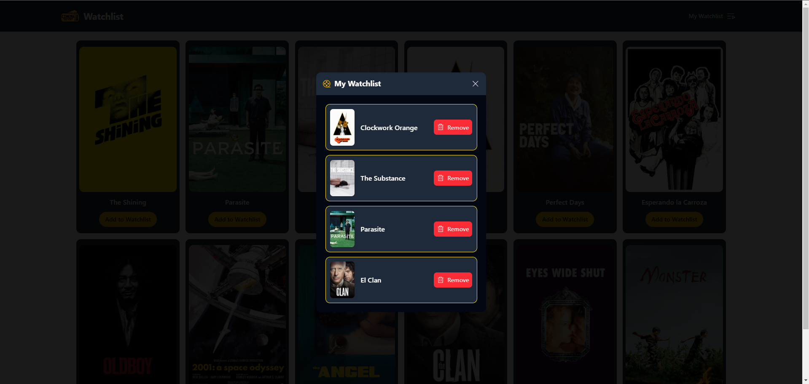

# 🎬 Watchlist

¡Bienvenido a **Watchlist**! 📽️ Esta es una aplicación desarrollada con **React y Vite** que permite a los usuarios gestionar una lista de películas por ver. Utiliza **TailwindCSS** para los estilos, **Framer Motion** para animaciones fluidas y **Phosphor Icons** para una mejor experiencia visual. 

---

## 🛠️ Tecnologías Utilizadas

### 📌 **Frontend**
- **React 18**: Librería principal para construir la UI.
- **Vite**: Entorno de desarrollo rápido y optimizado para React.
- **TailwindCSS**: Framework CSS para un diseño moderno y flexible.
- **Phosphor Icons**: Librería de íconos personalizables.
- **Framer Motion**: Para animaciones y transiciones fluidas.

### 🔗 **Herramientas de Desarrollo**
- **ESLint & Prettier**: Para mantener un código limpio y formateado.
- **React Hooks**: Manejo de estado con `useState`.
- **React Components**: Arquitectura basada en componentes reutilizables.

---

## ⚙️ Instalación y Configuración

1️⃣ Clonar el repositorio:
```bash
git clone https://github.com/tuusuario/watchlist-app.git
cd watchlist-app
```
2️⃣ Instalar dependencias:
```bash
npm install
```
3️⃣ Iniciar el entorno de desarrollo:
```bash
npm run dev
```

## 📂 Estructura del Proyecto
```css
📦 src
 ┣ 📂 assets
 ┃ ┗ 📂 imgMovies → Imágenes de las películas
 ┣ 📂 components
 ┃ ┣ 📜 Header.jsx → Barra superior con navegación
 ┃ ┣ 📜 MovieCardWatchlist.jsx → Tarjeta de cada película en la Watchlist
 ┃ ┣ 📜 WatchlistModal.jsx → Modal para mostrar la lista de películas
 ┃ ┣ 📜 EmptyWatchlist.jsx → Mensaje cuando la Watchlist está vacía
 ┣ 📂 utils
 ┃ ┗ 📜 paddingPage.js → Utilidad para espaciados
 ┣ 📜 App.jsx → Componente principal que maneja estados y lógica
 ┣ 📜 main.jsx → Punto de entrada de la aplicación
 ┣ 📜 index.css → Estilos globales

```

## 🏗️ Funcionalidades Implementadas
✅ **Lista de Películas**: Agregar y eliminar películas de la Watchlist.  
✅ **Modal Dinámico**: Aparece con animaciones suaves utilizando Framer Motion.  
✅ **Animaciones en los íconos y tarjetas**: Se aplican efectos hover y transiciones sutiles.  
✅ **Diseño Responsivo**: Adaptado para diferentes tamaños de pantalla con TailwindCSS.  
✅ **Componentes Reutilizables**: Cada sección de la app está separada en un componente específico.  

## 🎨 Estilos y UX
🔹 **Colores principales**: gray y yellow, con toques oscuros para coherencia visual.  
🔹 **Íconos de Phosphor**: FilmSlate para indicar lista vacía, Trash para eliminar películas.  
🔹** Hover Effects**: Botones con transiciones y scale en tarjetas de películas.  

## 🚀 Desarrollo con Vite
Usamos **Vite** en lugar de ``create-react-app`` porque:

🔥 **Es más rápido** al iniciar el servidor y compilar cambios.
🚀 **Mejor rendimiento** con optimización automática.
🎯 **Soporte para ES Modules y TypeScript** sin configuración extra.

## 🖼️ Capturas de Pantalla

| 🏠 Pantalla Principal | 🎬 Modal Watchlist |
|----------------------|------------------|
|  |  |

> @estenoesmonti （づ￣3￣）づ╭❤️～